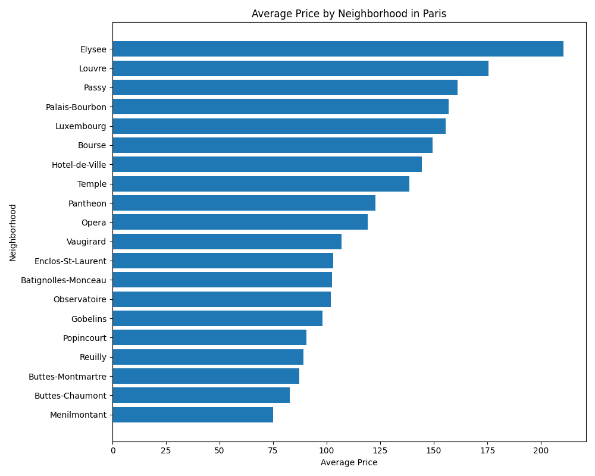
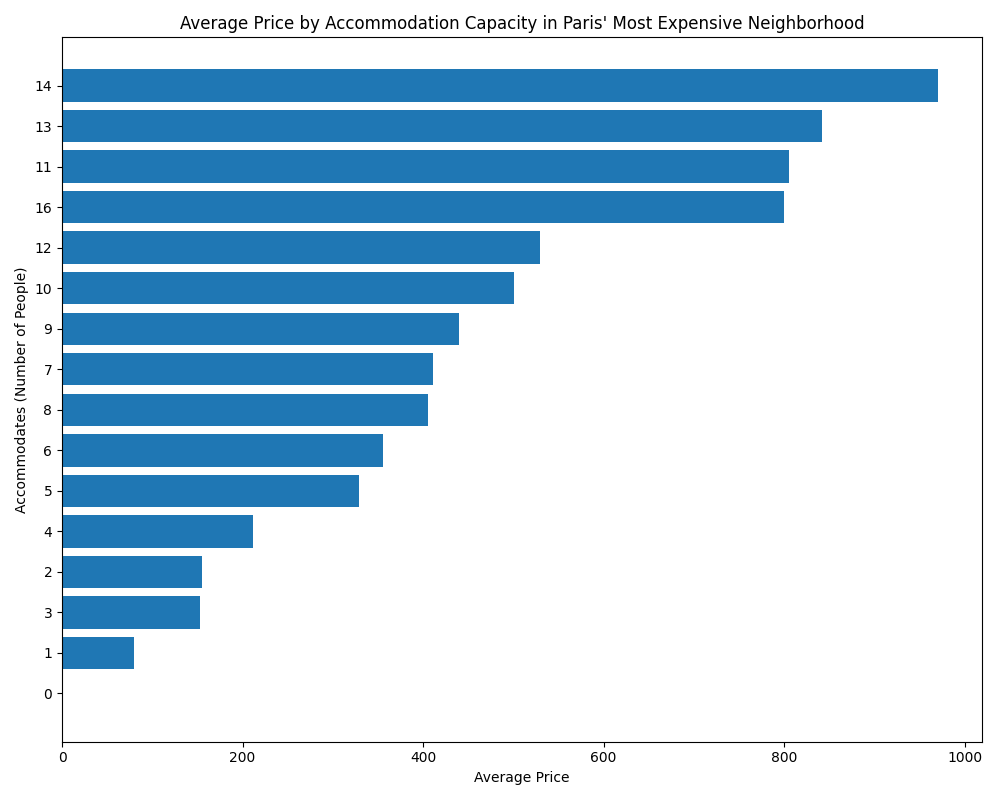
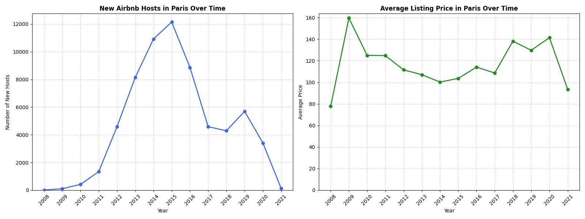

# Paris-Airbnb-Market-Analysis-Pricing-Host-Acquisition-Trends
An end-to-end exploratory data analysis of 64,000+ Airbnb listings in Paris using Python. This project identifies premium neighborhood pricing tiers, analyzes accommodation capacities, and visualizes historical host acquisition trends since 2008.

Paris Airbnb Market Analysis: Pricing & Host Acquisition Trends
Project Overview
This project executes an end-to-end exploratory data analysis on a raw dataset of over 64,000 Airbnb listings. The primary objective is to extract actionable market intelligence regarding Parisian neighborhood pricing tiers, the premium value of accommodation capacity, and historical host acquisition trends since 2008.

Tech Stack & Tools
Language: Python 3

Data Manipulation: Pandas

Data Visualization: Matplotlib, Seaborn

Environment: Jupyter Notebook

Data Pipeline & Methodology
Raw data in the real world is rarely ready for analysis. This project prioritized strict data cleaning and standardization before any aggregations were calculated:

Geographical Sanitization: Filtered the global dataset specifically for Paris listings using robust string methods (.str.lower().str.strip()) to prevent contamination from similarly named or misspelled global entries.

Temporal Engineering: Converted raw string date columns into optimized datetime objects to enable precise time-series grouping and resampling.

Anomaly Eradication: Identified and permanently dropped structurally invalid data points (e.g., listings showing zero price or zero capacity) to protect the mathematical integrity of the averages.

Null Handling: Evaluated a small cluster of missing values in the onboarding dates (representing ~0.05% of the dataset) and determined they offered no strategic value, resulting in their removal.

Key Insights & Visualizations
1. Neighborhood Pricing Hierarchy
To understand the baseline market rate across different zones, the data was grouped by neighborhood to calculate the mean price.

Insert your first graph here. Ensure the file is in the same folder as your README.

Takeaway: The pricing distribution clearly identifies the premium geographic tiers within the city, establishing a baseline for expected revenue based purely on location.

2. Capacity Valuation in Premium Markets
The analysis isolated the single most expensive neighborhood (Elysee) to determine how accommodation capacity scales with pricing power.

Insert your second graph here.

Takeaway: In premium markets, pricing does not scale linearly with capacity. There are distinct price jumps at specific accommodation thresholds (e.g., moving from a 10-person to a 12-person capacity), highlighting potential optimization points for property investors.

3. Historical Market Growth vs. Price Stability
To assess the long-term health of the Paris market, the dataset was resampled by year to track the volume of new host onboarding against the average listing price over a 10+ year horizon.

Insert your third graph here.

Takeaway: While new host acquisition shows significant volatility (peaking mid-decade before sharply declining), the average listing price remains relatively stable and resilient over the same period. (Note: The sharp drop in 2021 host acquisition reflects an incomplete data year at the time of extraction, not a sudden market crash).

How to Run This Project
Clone the repository to your local machine.

Ensure you have the required libraries installed: pip install pandas matplotlib numpy seaborn

Download the raw Listings.csv dataset and place it in the root directory.

Execute the Jupyter Notebook cell by cell to reproduce the cleaning pipeline and visualizations.
